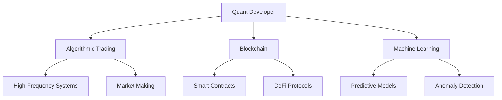
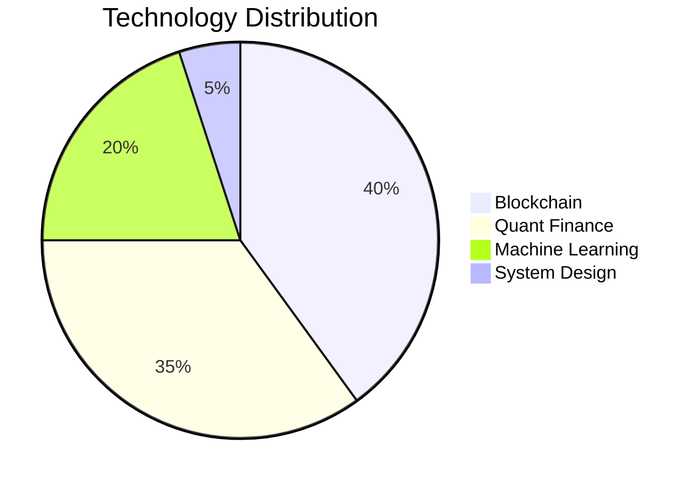
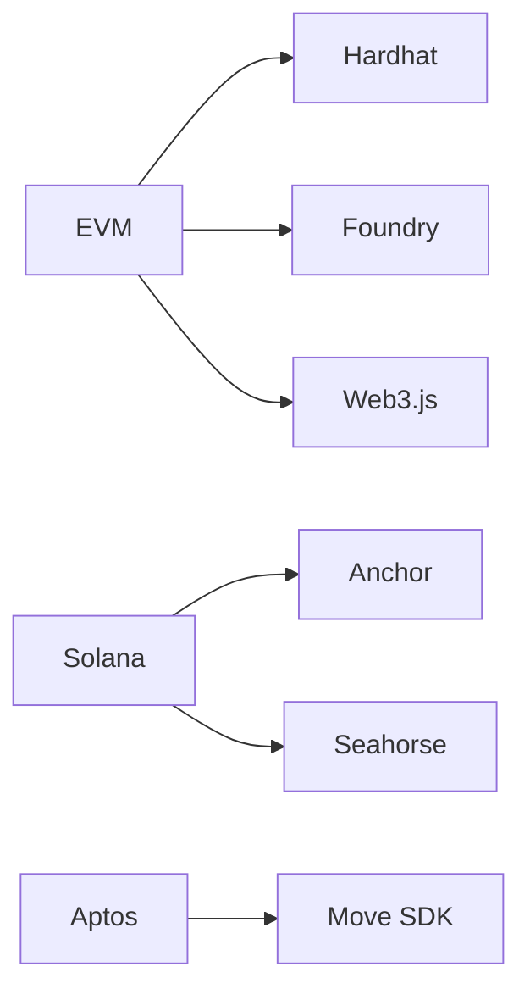
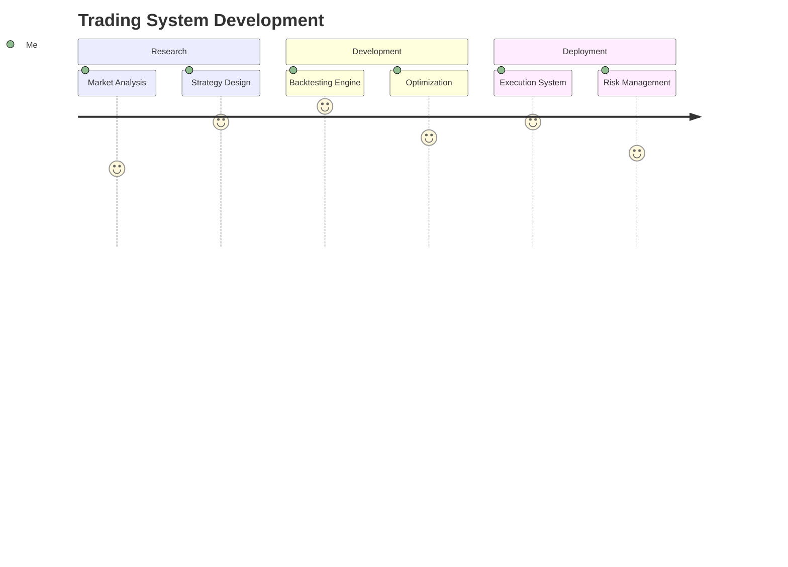
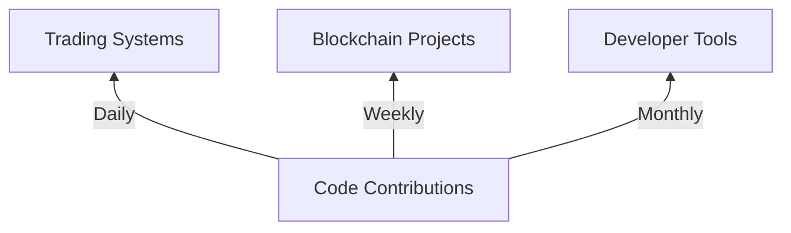
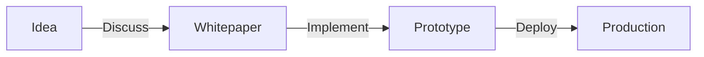

# 🚀 About Me

Quantitative developer and financial technologist specializing in:

- **Algorithmic Trading**: HFT systems, market-making algorithms, and quantitative research
- **Blockchain Development**: Smart contracts, DeFi protocols, and Web3 infrastructure
- **Data Science**: Time-series forecasting, statistical arbitrage, and ML-driven strategies
- **System Architecture**: High-performance trading systems and distributed computing



### 🎯 Core Skills

#### ⌨️ Programming Languages
<p>
    <a href="https://developer.mozilla.org/en-US/docs/Web/JavaScript" target="_blank"></a>
    <a href="https://www.python.org" target="_blank"></a>
    <a href="https://docs.soliditylang.org/en/latest/" target="_blank"></a>
    <a href="https://www.typescriptlang.org" target="_blank"></a>
    <a href="https://go.dev" target="_blank"></a>
    <a href="https://www.rust-lang.org" target="_blank"></a>
    <a href="https://vyper.readthedocs.io/en/stable/" target="_blank"></a>
    <a href="https://move-book.com/" target="_blank"></a>
</p>

#### 🎛 Frameworks and Runtime Environments
<p>
    <a href="https://angular.io" target="_blank"></a>
    <a href="https://nodejs.org" target="_blank"></a>
    <a href="https://pytorch.org" target="_blank"></a>
    <a href="https://www.tensorflow.org" target="_blank"></a>
    <a href="https://nestjs.com" target="_blank"></a>
    <a href="https://nextjs.org" target="_blank"></a>
</p>

#### ⚒️ Development Tools
<p>
    <a href="https://hardhat.org" target="_blank"></a>
    <a href="https://trufflesuite.com" target="_blank"></a>
    <a href="https://github.com/dapphub/dapptools" target="_blank"></a>
    <a href="https://github.com/foundry-rs/foundry" target="_blank"></a>
    <a href="https://www.anchor-lang.com/" target="_blank"></a>
</p>

#### 🗃 Dependency and Environment Management
<p>
    <a href="https://docs.conda.io/en/latest/" target="_blank"></a>
    <a href="https://www.npmjs.com" target="_blank"></a>
    <a href="https://pnpm.io" target="_blank"></a>
    <a href="https://yarnpkg.com" target="_blank"></a>
    <a href="https://www.docker.com" target="_blank"></a>
</p>

#### 🛠 Cloud & Infrastructure
<p>
    <a href="https://aws.amazon.com" target="_blank"></a>
    <a href="https://www.cloudflare.com" target="_blank"></a>
    <a href="https://kubernetes.io" target="_blank"></a>
    <a href="https://www.terraform.io" target="_blank"></a>
</p>

#### 🔧 Development Tools & Libraries
<p>
    <a href="https://git-scm.com" target="_blank"></a>
    <a href="https://www.postman.com" target="_blank"></a>
    <a href="https://numpy.org" target="_blank"></a>
    <a href="https://opencv.org" target="_blank"></a>
    <a href="https://scipy.org" target="_blank"></a>
</p>

#### 🌐 Web3 & Blockchain
<p>
    <a href="https://docs.ethers.org/v5/" target="_blank"></a>
    <a href="https://web3js.readthedocs.io/en/v1.8.2/" target="_blank"></a>
    <a href="https://thegraph.com/docs/en/" target="_blank"></a>
</p>

## 🛠 Technical Arsenal

### Core Competencies


#### Languages & Frameworks
| Category       | Technologies                                                                 |
|----------------|-----------------------------------------------------------------------------|
| **Trading**    |    |
| **Blockchain** |    |
| **Data**       |    |

#### Blockchain Ecosystem


## 🔭 Featured Projects

### Trading & Quantitative Finance


1. **[Market-Making Bot](https://github.com/yllvar/market-making-bot)**: Rust-based HFT system with adaptive spread logic
2. **[Quant Research Framework](https://github.com/yllvar/quant-research)**: Python toolkit for strategy development and backtesting
3. **[Volatility Arbitrage](https://github.com/yllvar/volatility-arbitrage)**: Statistical arbitrage strategy using options pricing models

### Blockchain & Web3
1. **[DeFi Yield Optimizer](https://github.com/yllvar/defi-yield-optimizer)**: Smart contract system for automated yield strategy rotation
2. **[Cross-Chain Bridge](https://github.com/yllvar/cross-chain-bridge)**: EVM-compatible bridge with zero-knowledge proofs
3. **[NFT Marketplace](https://github.com/yllvar/nft-marketplace)**: Gas-efficient marketplace with batch transactions

## 📈 Development Activity



| Metric              | Status                                                                 |
|---------------------|-----------------------------------------------------------------------|
| **Total Repos**     |           |
| **Active Projects** |      |
| **Languages**       |         |

## 📫 Collaboration Opportunities



Interested in:
- Advanced trading strategies (HFT, market-making)
- Blockchain protocol development
- Quantitative research collaborations
- Open-source financial infrastructure

Not interested in:
- Job recruiter and resumé parasites from LinkedIn 


```
