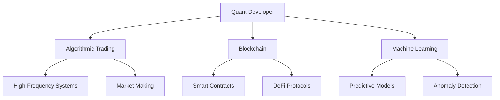
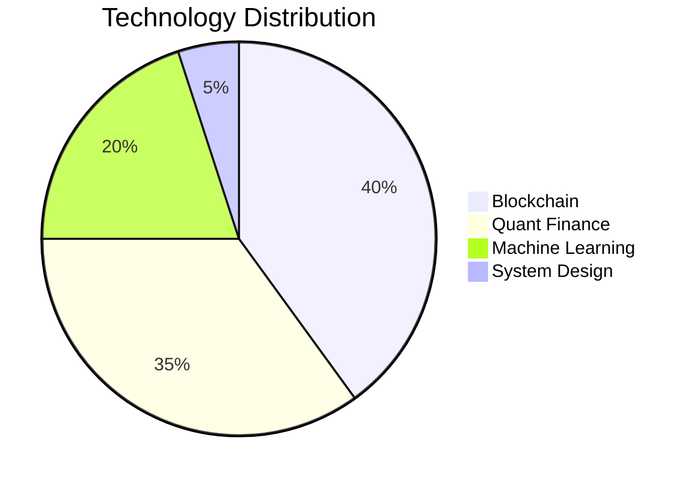
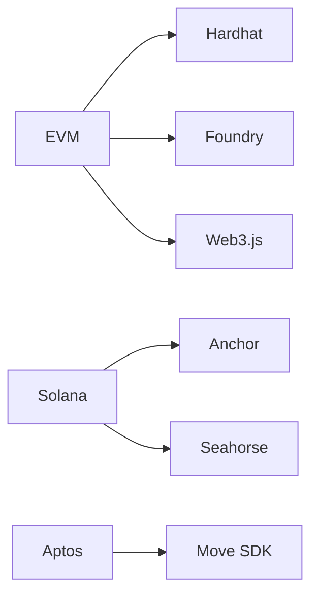
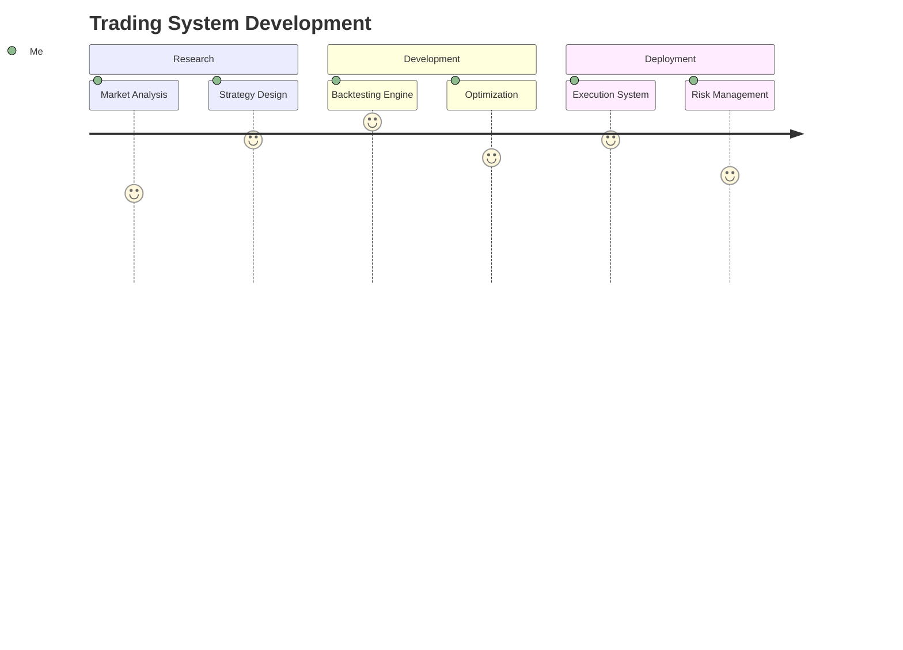
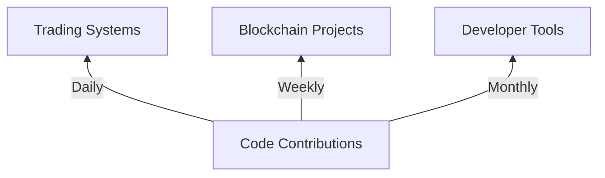
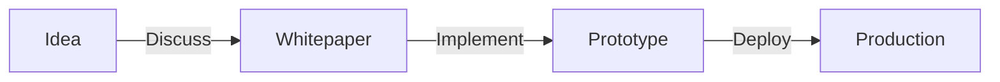

# 🚀 About Me

Quantitative developer and financial technologist specializing in:

- **Algorithmic Trading**: HFT systems, market-making algorithms, and quantitative research
- **Blockchain Development**: Smart contracts, DeFi protocols, and Web3 infrastructure
- **Data Science**: Time-series forecasting, statistical arbitrage, and ML-driven strategies
- **System Architecture**: High-performance trading systems and distributed computing




## 🛠 Technical Arsenal

### Core Competencies


#### Languages & Frameworks
| Category       | Technologies                                                                 |
|----------------|-----------------------------------------------------------------------------|
| **Trading**    |    |
| **Blockchain** |    |
| **Data**       |    |

#### Blockchain Ecosystem


## 🔭 Featured Projects

### Trading & Quantitative Finance


1. **[Market-Making Bot](https://github.com/yllvar/market-making-bot)**: Rust-based HFT system with adaptive spread logic
2. **[Quant Research Framework](https://github.com/yllvar/quant-research)**: Python toolkit for strategy development and backtesting
3. **[Volatility Arbitrage](https://github.com/yllvar/volatility-arbitrage)**: Statistical arbitrage strategy using options pricing models

### Blockchain & Web3
1. **[DeFi Yield Optimizer](https://github.com/yllvar/defi-yield-optimizer)**: Smart contract system for automated yield strategy rotation
2. **[Cross-Chain Bridge](https://github.com/yllvar/cross-chain-bridge)**: EVM-compatible bridge with zero-knowledge proofs
3. **[NFT Marketplace](https://github.com/yllvar/nft-marketplace)**: Gas-efficient marketplace with batch transactions

## 📈 Development Activity



| Metric              | Status                                                                 |
|---------------------|-----------------------------------------------------------------------|
| **Total Repos**     |           |
| **Active Projects** |      |
| **Languages**       |         |

## 📫 Collaboration Opportunities



Interested in:
- Advanced trading strategies (HFT, market-making)
- Blockchain protocol development
- Quantitative research collaborations
- Open-source financial infrastructure

Not interested in:
- Job recruiter and resumé parasites from LinkedIn 


```
